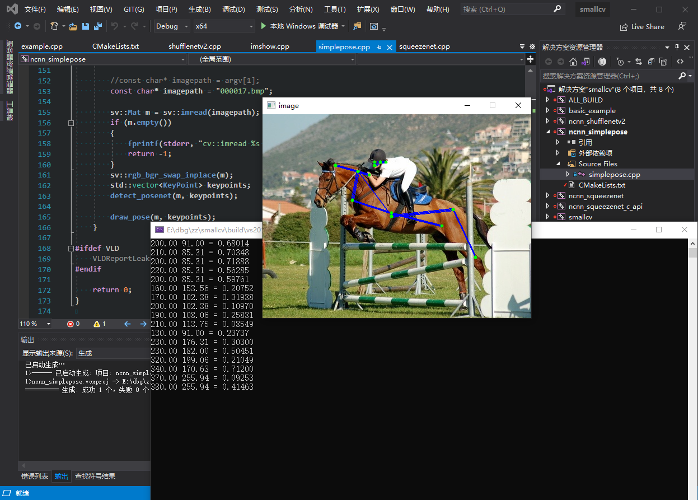

# SmallCV

[](https://github.com/zchrissirhcz/smallcv/actions/workflows/unit_test.yml)


Small Computer Vision Library.

## Features
- Lightweight
    - [x] C++11 based
    - [x] Not including optimization
- Conformance
    - [x] API compatible with OpenCV (identifier name keep same, values may differ)
    - [x] Same result on PC and Android


## APIs
- `Mat`
- `imread()`/`imwrite()`/`imshow()`


## Usage

Replace `#include <opencv2/opencv.hpp>` with `#include <smallcv/smallcv.hpp>`.


## Example
```c++
#include <string>
#include <smallcv/smallcv.hpp>

int main() {
    std::string image_path = "mingren.jpg";
    cv::Mat image = cv::imread(image_path);
    cv::Rect rect(100, 100, 233, 233);
    cv::rectangle(image, rect, cv::Scalar(0,0,255), 2);
    cv::imshow("mingren", image);
    cv::waitKey(0);
    cv::imwrite("mingren_swap.bmp", image);

    return 0;
}
```




## Acknowledgement

SmallCV referenced the following projects：

- [OpenCV](https://github.com/opencv/opencv)
- [ncnn](https://github.com/tencent/ncnn)
- [shufaCV](https://github.com/scarsty/shufaCV)

