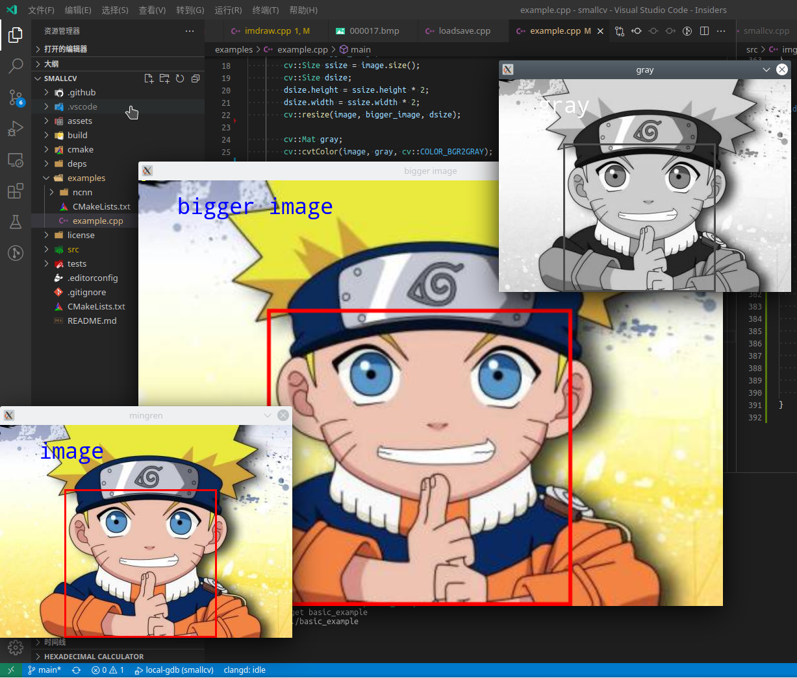

# SmallCV

[](https://github.com/zchrissirhcz/smallcv/actions/workflows/unit_test.yml)


Small Computer Vision Library.

## Features
- Lightweight
    - [x] C++11 based
    - [x] Not including optimization
- Conformance
    - [x] API like OpenCV
    - [x] Same result on PC and Android


## APIs
Supported:
- `Mat`
- `imread()`/`imwrite()`/`imshow()`/`waitKey()`
- `cvtColor()`/`resize()`
- `putText()`/`rectangle()`/`circle()`/`line()`

Not supported:
- `Mat::clone()`
- `saturate_cast`
- `parallel_for_`
- `operator Point_<Tp2>`


## Getting Started

To build this project, you are assumed:

- Familiar with CMake based C/C++ building
- Install **glfw** for `imshow()`. See [deps/glfw_build](deps/glfw_build) for build hints.
- Modify [cmake/deps.cmake](cmake/deps.cmake) to specify dependencies paths.

```bash
cd build
./linux-x64.sh   # Linux build
./Xcode.sh       # macOSX build
.\vs2019-x64.cmd # Windows build
```

## Example Usage
```c++
#include <string>
#include "smallcv.hpp"

int main() {
    std::string image_path = "mingren.jpg";
    cv::Mat image = cv::imread(image_path);
    cv::Rect rect(100, 100, 233, 233);
    cv::rectangle(image, rect, cv::Scalar(0,0,255), 2);
    cv::imshow("mingren", image);
    cv::waitKey(0);
    cv::imwrite("mingren_swap.bmp", image);

    return 0;
}
```


```c++
#include <string>
#include "smallcv.hpp"

int main()
{
    std::string image_path = "mingren.jpg";
    //std::string image_path = "E:/projects/arccv/smallcv/build/vs2019-x64/mingren.jpg";
    cv::Mat image = cv::imread(image_path);
    cv::Rect rect(100, 100, 233, 233);
    cv::rectangle(image, rect, cv::Scalar(0,0,255), 2);
    
    cv::Mat bigger_image;
    cv::Size ssize = image.size();
    cv::Size dsize = ssize * 2;
    cv::resize(image, bigger_image, dsize);

    cv::Mat gray;
    cv::cvtColor(image, gray, cv::COLOR_BGR2GRAY);
    

    cv::putText(image, "image", cv::Point(60, 60), 10, 1, cv::Scalar(255, 0, 0), 2);
    cv::putText(bigger_image, "bigger image", cv::Point(60, 60), 10, 1, cv::Scalar(255, 0, 0), 2);
    cv::putText(gray, "gray", cv::Point(60, 60), 10, 1, cv::Scalar(255, 0, 0), 2);

    cv::imshow("mingren", image);
    cv::imshow("bigger image", bigger_image);
    cv::imshow("gray", gray);

    cv::waitKey(0);

    cv::imwrite("image.png", image);
    cv::imwrite("bigger_image.png", bigger_image);
    cv::imwrite("gray.png", gray);
}
```



## Acknowledgement

SmallCV referenced the following projects：

- [OpenCV](https://github.com/opencv/opencv)
- [ncnn](https://github.com/tencent/ncnn)
- [shufaCV](https://github.com/scarsty/shufaCV)

